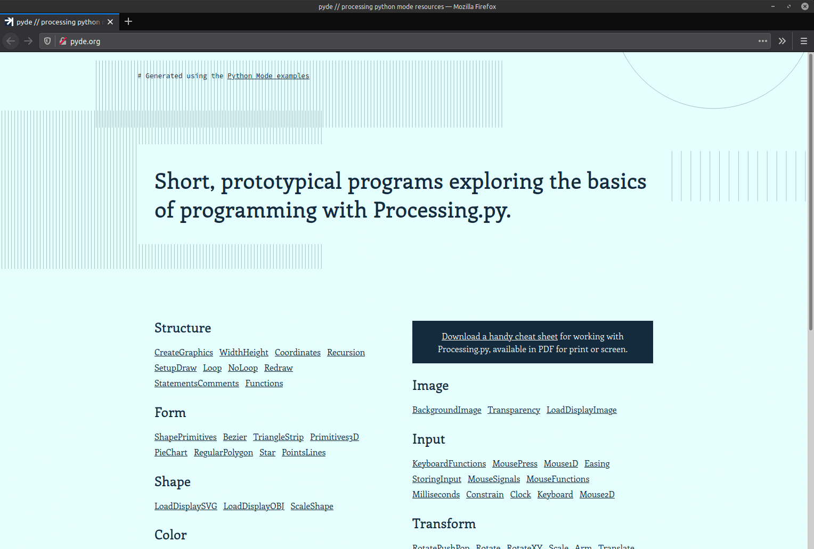

# pyde.org

*A collection of examples, cheatsheets, and other Processing Python Mode / Processing.py resources*

This repository hosts the source files for [PYDE.ORG](http://pyde.org), which includes Python Mode ports of the Java examples on the official [Processing wesbite](https://processing.org/examples/). Processing includes these examples in Python Mode (accessible in the IDE from the *File > Examples...* menu).

## Instructions

This is a hand-rolled static site generator built using [Jinja2](https://jinja.palletsprojects.com/en/2.11.x/) for templating and [pyp5js](https://berinhard.github.io/pyp5js/) to transpile processing.py files to p5.js. It uses a modified [Pygments](https://pygments.org/) lexer for syntax highlighting.

Install the relevant Python 3 libraries (see *requirements.txt*). Run *python3 generate.py* to generate the website (that's output to the *_site* directory).

The *generate.py* script transpile sketches you place the *examples* directory. It requires them organized as follows: *category > sub-category > sketch > sketch.pyde*. For example: *Basics > Structure > Coordinates > Coordinates.pyde*

Note that pyp5js has it's [limitations](https://berinhard.github.io/pyp5js/#known-issues-and-differences-to-the-processingpy-and-p5js-ways-of-doing-things), related to differences between Processing.py and p5.js.

### Using the Standard Python Mode Examples

You can retrieve the Python Mode / Processing.py example files from https://github.com/jdf/processing.py/tree/master/mode/examples, and place those in the *examples* directory. 

There are some sketches that are problematic that you'll need to delete. Many fail because of the way they're organized (directory structure) which isn't difficult to fix manually. 

You'll need to delete or reorganise the following:

* *Advanced* (directory structure incompatible)
* *Contributed Libraries in Python* (I still need to look at libraries)
* *Python Mode Differences* (directory structure incompatible)
* *Topics/ContinuousLines* (directory structure incompatible)
* *Topics/File IO/LoadFile2* (can't import from module collections)
* *Topics/Pattern* (directory structure incompatible)
* *Topics/Pulses* (directory structure incompatible)
* Refer to the [checklist](checklist.txt) for other problematic files

**Just because the transpiling process runs, and the website builds, doesn't mean all of the sketches will work**. This is still, very much, a work in progress. Some sketches will require manual intervention / some rewriting. I plan to work through the [checklist](checklist.txt) whenever I get the time. I've used regex/`replace()` as workarounds for what pyp5js can't handle right now, which might result in odd behavior (for example, if the generate script detects keywords in your sketch comments). You can check the contents of the *examples/_temp* directory to examine what might cause some sketch to fail.

## Todo

- [ ] integrate pyp5js
  - [x] refactor generate.py
  - [x] generate example directories from md (then compile and move them into _site)
  - [x] replace p5js functions in transcrypt-ed code to processing.py -- i.e. `createCanvas()` to `size()`
  - [ ] make canvas responsive for mobile
  - [ ] embed p5js canvas in iframe? (mouse coordinates relative to entire window)
  - [ ] workarounds (in generate.py) should ignore commented code
  - [ ] create workaround for svg `.disableStyle()`, `.getChild()`, `.getChildCount()` methods?
  - [ ] improve regex/`replace()` patterns
  - [ ] ...
- [ ] style website
  - [ ] generate sidebar
  - [x] add footer (with credits for processing, pyp5js, github repo)
  - [ ] define colors and fonts with inspiration from the processing.org website
  - [ ] define layout with inspiration from generative design (new book) website?
  - [ ] refine pygments highlighting
    - [ ] style setup(), draw(), etc. processing functions
  - [ ] ...
- [ ] add lessons (from tabreturn.github.io)?
- [ ] design cheetsheat
  - [ ] see oc/temp files
  - [ ] ...
- [ ] add readme screenshot
- [ ] fix
  - [x] example page code listing must display original code (i.e. unindented with no setup and draw)
- [ ] other ...
